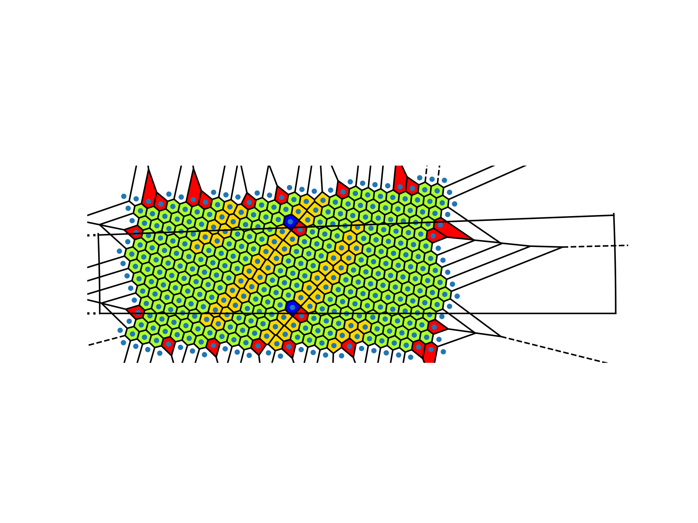
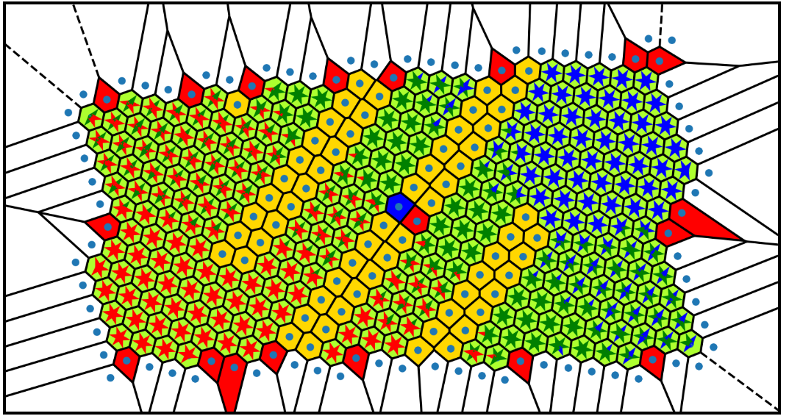
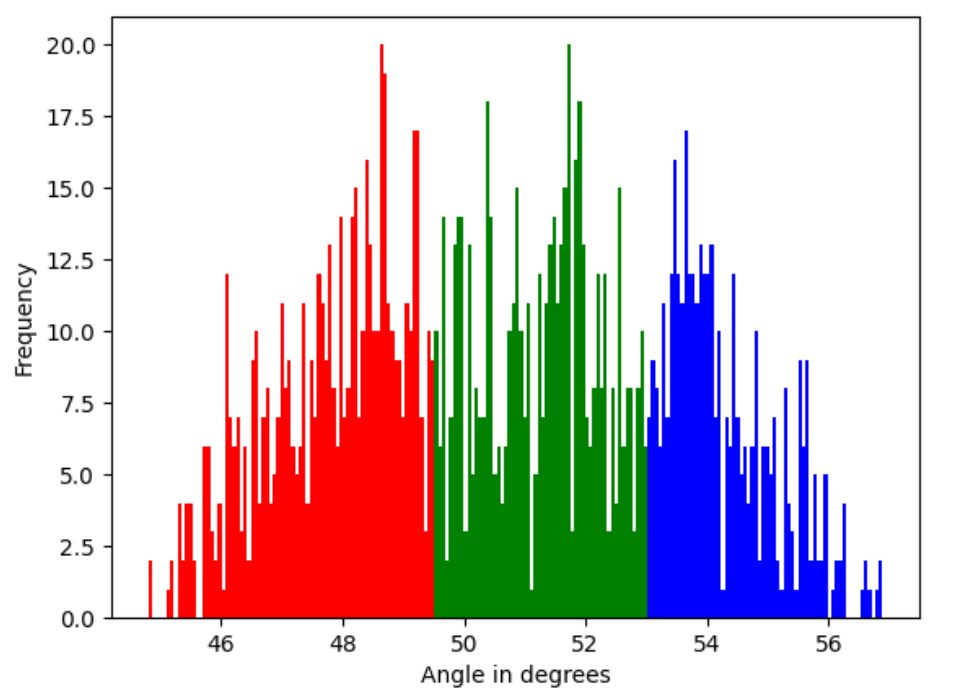
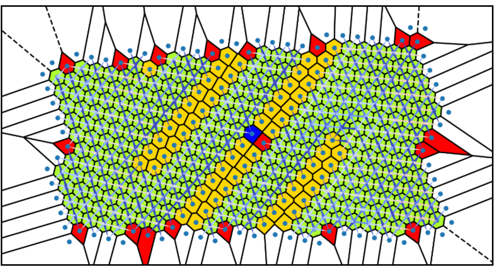
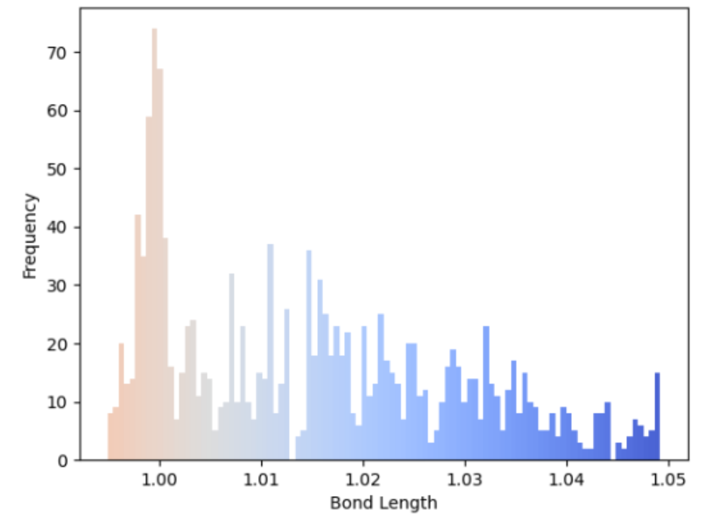

# colloidsoncones
Analysis, visualisation and manipulation Python scripts from MSc project with Prof. Halim Kusumaatmaja and Dr Mark Miller. The project looked at the effect of confining conical surfaces on the structure of two-dimensional, model colloidal crystals.

